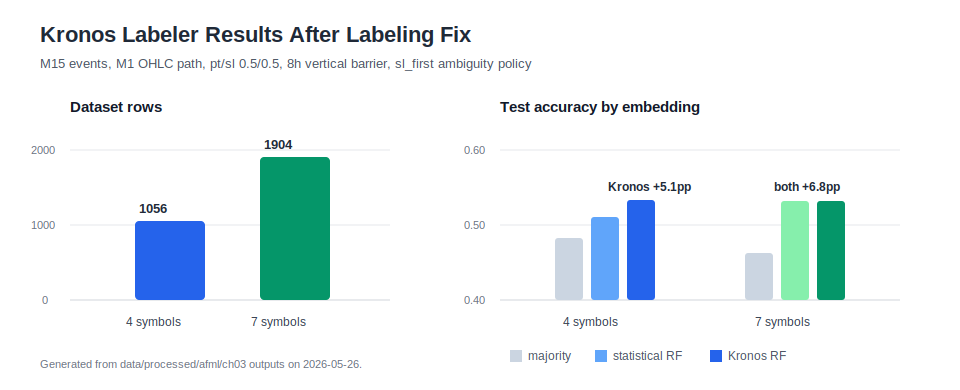

# Labeling Research Report

This document is the research report and design reference for the AFML Chapter 3 labeling work in DeepFX Alpha Lab.

It keeps the core labeling concepts and formulas, but its primary purpose is now to record:

- which label geometry is used,
- which experiments were run,
- what was rejected,
- what the current target is,
- what should be tested next.

Executable study code and outputs live under:

```text
studies/afml/ch03-labeling/
src/deepfx_alpha_lab/labeling/
src/deepfx_alpha_lab/kronos/
data/processed/afml/ch03/
```

---

## Executive Summary

Current recommendation:

```text
Target:
- event timeframe: M15
- path timeframe: M1 OHLC
- symbols: XAUUSD, XAGUSD, NAS100, US30 first
- pt/sl: 0.5 / 0.5
- vertical barrier: 8h
- ambiguity policy: sl_first
- model target: first barrier type: pt / sl / t1
```

Current interpretation:

- Triple-barrier label geometry is usable as the research foundation.
- M15 event + M1 OHLC execution path is the strongest near-term target for the H1/M15 discretionary workflow.
- H1 event + M1 OHLC path is cleaner but currently sample-starved, so it should be treated as a comparison/regime target.
- EMA/BB primary-signal meta-labeling with RandomForest is rejected as a near-term edge candidate.
- The Kronos labeler dataset now stores two tensors:
  - `x`: normalized statistical features for cheap baselines.
  - `kronos_x`: raw OHLCVA windows for frozen Kronos embeddings.
- Frozen Kronos `mean_last` embeddings show a small single-cutoff lift on the 4-symbol RandomForest result, but do not clearly dominate on the 7-symbol set.

Next step:

```text
Run embedding ablations before any trading interpretation:
- pooling: last vs mean vs mean_last
- model size: mini vs larger Kronos variants if available
- classifier: linear probe vs RandomForest
- validation: fold-based walk-forward, not one train/test split only
```

---

## Latest Results

These results were regenerated on 2026-05-26 and should be read as a historical single-cutoff baseline:

```text
1. OHLC path labels ignore the entry bar high/low and start after t0.
2. Kronos datasets save raw OHLCVA windows as kronos_x.
3. Classifier train/test split uses a timestamp cutoff, so duplicate timestamps do not cross train/test.
4. torch/kronos optional dependencies are installed with:
   just setup
```

Current code now also persists actual selected bar timestamps as `window_times` for rebuilt Kronos datasets and uses a prior-bar daily volatility CUSUM threshold instead of a full-sample volatility mean. Regenerated row counts and baseline metrics may therefore differ from the table below.



### M15 vs H1 OHLC Sweep

The preferred XAUUSD target remains M15 events with an M1 OHLC execution path.

| Event TF | Path TF | pt/sl | Vertical barrier | Events | Positive rate | PT rate | SL rate | t1 rate | Median hold |
| --- | --- | ---: | ---: | ---: | ---: | ---: | ---: | ---: | ---: |
| M15 | M1 OHLC | 0.5 / 0.5 | 8h | 273 | 53.5% | 47.3% | 41.0% | 11.7% | 90m |
| H1 | M1 OHLC | 0.5 / 0.5 | 8h | 129 | 51.9% | 38.8% | 40.3% | 20.9% | 127m |

Interpretation:

- M15 provides roughly twice the sample size of H1 while keeping acceptable label balance.
- H1 has a clean distribution, but 129 XAUUSD events over the current history is too small for a standalone supervised labeler.
- M15 should be the main target; H1 should remain a comparison target.

### Kronos Dataset Refresh

The preferred M15/M1 OHLC target was regenerated for live-strategy and broader research symbol sets.

| Dataset | Symbols | Rows | Shape | Bin distribution | Type distribution |
| --- | ---: | ---: | --- | --- | --- |
| Live-strategy | 4 | 1056 | `(1056, 96, 6)` | `-1: 491`, `1: 565` | `pt: 489`, `sl: 433`, `t1: 134` |
| Research | 7 | 1904 | `(1904, 96, 6)` | `-1: 897`, `1: 1007` | `pt: 880`, `sl: 807`, `t1: 217` |

Both regenerated `.npz` files contain:

```text
x.shape        = (rows, 96, 6)
kronos_x.shape = (rows, 96, 6)
```

### Embedding Baselines

The statistical embedding baseline is a floor, not a trading edge. Frozen Kronos was run with:

```text
model: NeoQuasar/Kronos-mini
tokenizer: NeoQuasar/Kronos-Tokenizer-2k
pooling: mean_last
batch size: 64
device: cuda:0
```

| Dataset | Embedding | Train rows | Test rows | Majority accuracy | Logistic accuracy | RandomForest accuracy | RF balanced accuracy | RF edge vs majority |
| --- | --- | ---: | ---: | ---: | ---: | ---: | ---: | ---: |
| 4 symbols | statistical | 741 | 315 | 48.3% | 42.2% | 51.1% | 51.3% | +2.9pp |
| 4 symbols | frozen Kronos | 741 | 315 | 48.3% | 47.0% | 53.3% | 50.9% | +5.1pp |
| 7 symbols | statistical | 1347 | 557 | 46.3% | 52.2% | 53.1% | 51.3% | +6.8pp |
| 7 symbols | frozen Kronos | 1347 | 557 | 46.3% | 45.2% | 53.1% | 49.7% | +6.8pp |

Interpretation:

- 4-symbol frozen Kronos shows a small single-cutoff RandomForest lift from 51.1% to 53.3%.
- 7-symbol frozen Kronos ties statistical RandomForest on accuracy but has lower balanced accuracy.
- This is useful representation evidence, not enough for trading claims.
- The next question is whether the Kronos lift survives pooling ablations and walk-forward folds.

---

## Methodology

### Fixed-Time Horizon Labeling

Fixed-time horizon labeling assigns a label from the return after a fixed horizon.

Return:

$$
r_{t_{i,0}, t_{i,0}+h} = \frac{P_{t_{i,0}+h}}{P_{t_{i,0}}} - 1
$$

Label:

$$
y_i =
\begin{cases}
-1, & \text{if } r_{t_{i,0}, t_{i,0}+h} < -\tau \\
0, & \text{if } |r_{t_{i,0}, t_{i,0}+h}| \le \tau \\
1, & \text{if } r_{t_{i,0}, t_{i,0}+h} > \tau
\end{cases}
$$

This method is simple, but it is not the preferred target for this project because:

- the threshold is fixed across volatility regimes,
- the horizon is fixed,
- the label ignores whether a stop-loss or profit-taking barrier was touched before expiry.

### Triple-Barrier Labeling

Triple-barrier labeling assigns a label according to the first exit condition touched:

1. Upper horizontal barrier: profit-taking.
2. Lower horizontal barrier: stop-loss.
3. Vertical barrier: maximum holding period.

For an event at $t_0$:

$$
\text{Upper barrier} = P_{t_0}(1 + pt \cdot \sigma_{t_0})
$$

$$
\text{Lower barrier} = P_{t_0}(1 - sl \cdot \sigma_{t_0})
$$

$$
\text{Vertical barrier} = t_0 + h
$$

where:

| Symbol | Meaning |
| --- | --- |
| $pt$ | profit-taking multiplier |
| $sl$ | stop-loss multiplier |
| $\sigma_{t_0}$ | target volatility at event time |
| $h$ | maximum holding period |

Label:

$$
y_i =
\begin{cases}
1, & \text{if the upper barrier is touched first} \\
-1, & \text{if the lower barrier is touched first} \\
\text{sign}(r_{t_0,t_1}) \text{ or } 0, & \text{if the vertical barrier is touched first}
\end{cases}
$$

In this project, the Kronos labeler predicts the first barrier type directly:

```text
pt / sl / t1
```

That target is more informative than reducing the label immediately to directional `-1 / 0 / 1`.

### OHLC Execution-Aware Path

Close-path triple-barrier labeling can miss intrabar touches. The execution-aware variant evaluates M1 path bars using `high` and `low`:

```text
profit-taking touched if high / entry_price - 1 >= pt * target
stop-loss touched if low / entry_price - 1 <= -sl * target
```

Because OHLC does not contain the order of high and low inside the same bar, same-bar PT/SL touches are ambiguous. The current conservative policy is:

```text
ambiguous_policy = sl_first
```

Correctness fix:

```text
The path starts after t0.
The entry bar's high/low is not allowed to trigger a barrier.
```

Reason: if entry uses the close at `t0`, then the high/low of the same bar may have occurred before the trade existed.

### Meta-Labeling

Meta-labeling is used when a primary model already decides the trade side.

Primary model:

```text
side in {-1, 1}
```

Side-adjusted return:

$$
r_i^{meta} = s_i \cdot r_i
$$

Meta-label:

$$
y_i^{meta} =
\begin{cases}
1, & \text{if the primary signal was profitable} \\
0, & \text{otherwise}
\end{cases}
$$

This project tested EMA crossover and Bollinger-band mean-reversion primary signals. Those experiments were rejected as edge candidates because RandomForest meta-labeling did not produce robust enough out-of-sample evidence.

### Method Comparison

| Method | Predicts | Label space | Path-dependent? | Current status |
| --- | ---: | ---: | ---: | --- |
| Fixed-time horizon | direction after fixed horizon | `-1 / 0 / 1` | No | Not preferred |
| Triple-barrier | first touched exit condition | `pt / sl / t1` or `-1 / 0 / 1` | Yes | Preferred |
| Meta-labeling | whether to take a primary signal | `0 / 1` | Usually yes | Rejected for current EMA/BB primaries |
| OHLC triple-barrier | first executable high/low touch | `pt / sl / t1` | Yes | Preferred path model |

---

## Experiment Design

### Data

Current experiment window:

```text
start: 2026-01-01
end: 2026-06-01 exclusive
latest included bars: 2026-05-25
```

Primary symbol groups:

| Group | Symbols | Purpose |
| --- | --- | --- |
| Live-strategy | `XAUUSD`, `XAGUSD`, `NAS100`, `US30` | first deployment-style representation tests |
| Research | `XAUUSD`, `XAGUSD`, `NAS100`, `US30`, `EURUSD`, `GBPUSD`, `USDJPY` | broader representation sanity check |

### Label Geometry

Current preferred setting:

```text
event bars: M15
path bars: M1 OHLC
event sampling: symmetric CUSUM
event threshold: prior-bar EWMA daily volatility
target volatility: EWMA daily volatility
pt/sl: 0.5 / 0.5
vertical barrier: 0.3333333333 days, about 8h
lookback: 96 M15 bars
same-bar ambiguity: sl_first
```

### Dataset Contract

The Kronos labeler dataset contains labels plus two feature tensors:

```text
x:
  normalized statistical features
  columns: open, high, low, close, tick_volume, return_1
  use: statistical_window_summary baseline

kronos_x:
  raw Kronos contract features
  columns: open, high, low, close, volume, amount
  amount = volume * close
  use: upstream Kronos tokenizer and frozen encoder

window_times:
  actual selected event-bar timestamps for each kronos_x window
  dtype: int64 nanosecond timestamps
  use: Kronos time covariates
```

This separation matters. The dataset stores raw OHLCVA-like `kronos_x` windows instead of the pre-normalized relative features used by the statistical baseline. The current frozen encoder path then applies per-window z-score normalization and clipping before calling the upstream Kronos tokenizer:

```text
normalization: per_window_zscore
clip: 5.0
timestamp source: window_times when present; reconstructed fixed grid only for older datasets
```

### Classifier Protocol

The current classifier target is:

```text
y_type: pt / sl / t1
```

The split is time-aware:

```text
train: older timestamps
test: newer timestamps
duplicate timestamps: always kept on the same side of the cutoff
```

Classifier set:

```text
majority baseline
logistic regression with class_weight=balanced
random forest with class_weight=balanced_subsample
```

The classifier is only a label-prediction sanity check. It is not a trading backtest.

---

## Decision Log

### Accepted

| Decision | Reason |
| --- | --- |
| Use triple-barrier labeling | path-dependent labels align better with stop/target style trading decisions |
| Use M1 OHLC path under M15 events | captures intrabar touches without exploding event count |
| Use M15 as main target | better sample count than H1 with acceptable balance |
| Keep H1 as comparison target | cleaner, slower regime view but too few events |
| Store `kronos_x` separately | avoids sending distorted relative features into Kronos |
| Store `window_times` separately | makes Kronos time covariates match the actual selected bars |
| Split by timestamp cutoff | avoids leakage across symbols with identical event timestamps |

### Rejected Or Not Yet Accepted

| Candidate | Status | Reason |
| --- | --- | --- |
| Fixed horizon labels | rejected as primary target | ignores path and volatility-adaptive exits |
| EMA crossover meta-labeling | rejected as edge candidate | weak out-of-sample evidence |
| BB mean-reversion meta-labeling | rejected as edge candidate | weak out-of-sample evidence |
| H1-only Kronos target | not accepted yet | sample-starved on current history |
| Frozen Kronos as final representation | not accepted yet | promising on 4 symbols, inconclusive on 7 symbols |

---

## Reproducibility

### Environment

Install the full research environment:

```bash
just setup
```

Kronos source is expected at:

```text
${KRONOS_REPO:-/data/LLM/models/Kronos}
```

ClickHouse credentials are loaded from `.env`.

### Commands

Regenerate every experiment used by this report:

```bash
just afml-labeling-report
```

Regenerate M15 sweep:

```bash
just afml-mtf-ohlc-sweep-m15
```

Regenerate H1 sweep:

```bash
just afml-mtf-ohlc-sweep-h1
```

Regenerate 4-symbol Kronos dataset:

```bash
just afml-kronos-tb-labeler-multisymbol
```

Regenerate 7-symbol Kronos dataset:

```bash
just afml-kronos-tb-labeler-7symbols
```

Run 4-symbol statistical baseline:

```bash
just afml-kronos-tb-baseline
```

Run 7-symbol statistical baseline:

```bash
just afml-kronos-tb-baseline-7symbols
```

Run 4-symbol frozen Kronos baseline:

```bash
just afml-kronos-tb-baseline-kronos
```

Run 7-symbol frozen Kronos baseline:

```bash
just afml-kronos-tb-baseline-kronos-7symbols
```

### Output Files

Core output directory:

```text
data/processed/afml/ch03/
```

Kronos output directory:

```text
data/processed/afml/ch03/kronos/
```

Key outputs:

```text
mtf_ohlc_barrier_sweep_xauusd_m15_event_m1_path_ohlc_sl_first_202601_202605.csv
mtf_ohlc_barrier_sweep_xauusd_h1_event_m1_path_ohlc_sl_first_202601_202605.csv
kronos_tb_labeler_4symbols_multisymbol_m15_m1_ohlc_pt05_sl05_8h_202601_202605.npz
kronos_tb_labeler_7symbols_7symbols_m15_m1_ohlc_pt05_sl05_8h_202601_202605.npz
*_stat_embedding_baseline.json
*_kronos_mean_last_embedding_baseline.json
```

---

## Known Limitations

- Current history is short: January 2026 through May 25, 2026.
- H1 labels are sample-starved.
- OHLC same-bar ambiguity cannot be fully solved without tick order; `sl_first` is conservative, not objectively true.
- Classifier accuracy is not a trading metric.
- Frozen Kronos results use one train/test cutoff, not a complete walk-forward fold study.
- The 2026-05-26 result table predates the current `window_times` and prior-bar CUSUM threshold rebuild path; reruns may change event counts and metrics.
- Model outputs are label-prediction evidence only; economic validation still needs PnL, drawdown, trade count, turnover, and regime breakdown.

---

## Appendix: AFML Exercise Mapping

### Exercise 3.1

Implemented as the baseline triple-barrier pipeline:

```text
price bars
-> CUSUM event sampling
-> daily volatility target
-> vertical barrier
-> triple-barrier events
-> bins
```

The project started with XAUUSD M1/M5 close-path labels, then moved toward M15 events with M1 OHLC paths.

### Exercise 3.3

Implemented as a vertical-barrier label policy comparison:

| Policy | Meaning |
| --- | --- |
| `sign(return)` | vertical expiry still becomes directional |
| `0` | vertical expiry means no decisive move |

For the Kronos labeler, the preferred target is not only the final bin but the event type `pt / sl / t1`.

### Exercise 3.4

Implemented as primary-signal meta-labeling:

```text
primary signal: EMA crossover or BB mean reversion
meta target: trade / skip
model: RandomForest
```

Those primary signals were rejected as current edge candidates. The useful carry-forward lesson is the validation protocol: time-aware splits, class-balance checks, and economic interpretation after label prediction.

### Minimal Research Checklist

```text
[x] Implement close-path triple-barrier baseline
[x] Add vertical-barrier zero variant
[x] Test primary-signal meta-labeling
[x] Add OHLC execution-aware path labeling
[x] Fix entry-bar leakage
[x] Build multi-symbol Kronos label datasets
[x] Add statistical embedding baseline
[x] Add frozen Kronos embedding baseline
[ ] Run pooling ablations
[ ] Run walk-forward classifier validation
[ ] Run economic walk-forward validation
```
