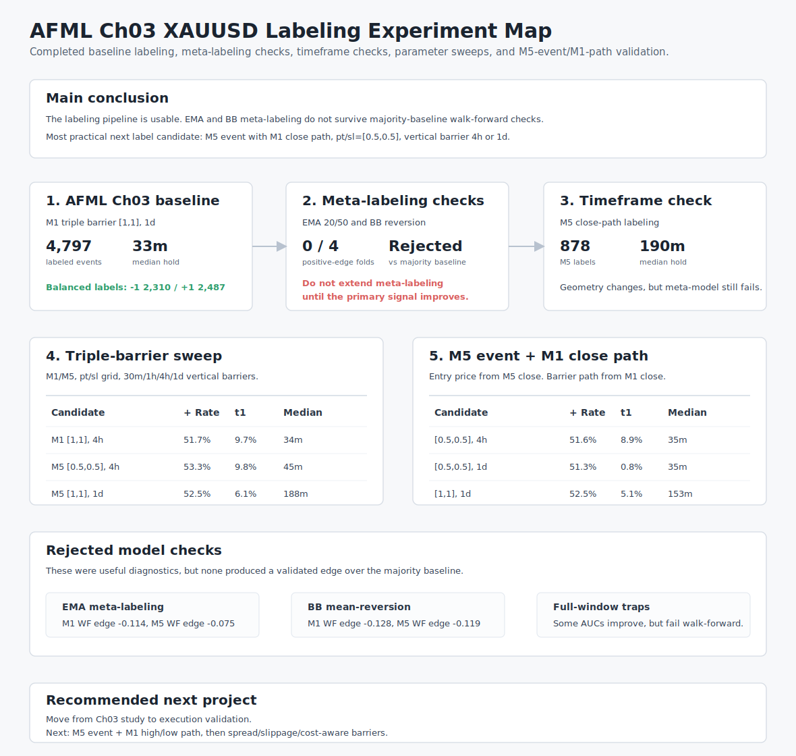

# AFML Chapter 3 Labeling Mini Project

This mini project reproduces the practical parts of AFML Chapter 3 on DeepFX data.

The first pass intentionally uses XAUUSD M1 time bars from `ohlcv` instead of dollar bars. Tick volume is available on M1 bars, but true traded volume is not reliable enough yet for AFML-style dollar bars.

## Result Map



## Exercise 3.1

Pipeline:

```text
XAUUSD M1 time bars
-> deduplicate timestamps
-> optional sparse-day filtering
-> daily volatility target
-> symmetric CUSUM event sampling
-> 1-day vertical barrier
-> triple barrier with ptSl=[1,1]
-> getBins labels
```

Setup:

```bash
cp .env.example .env
# Fill in CLICKHOUSE_* values in .env.
just setup
```

Run:

```bash
just afml-31
```

Default outputs:

```text
data/processed/afml/ch03/exercise_3_1_xauusd_m1_labels.csv
data/processed/afml/ch03/exercise_3_1_xauusd_m1_summary.json
```

Useful options:

```bash
just afml-31-window 2026-01-01 2026-02-01
```

For non-default parameters, run the script directly:

```bash
python studies/afml/ch03-labeling/scripts/01_triple_barrier_xauusd_m1.py --pt 1 --sl 1 --vol-span 100
```

Latest baseline result:

```text
raw rows after dedup: 135386
rows after sparse-day filter: 135123
CUSUM events: 4800
triple-barrier events: 4798
labeled events: 4797
label distribution: {-1: 2310, 1: 2487}
barrier distribution: {pt: 2470, sl: 2284, t1: 43}
median holding minutes: 33.0
average holding minutes: 160.24
```

## Exercise 3.3

Exercise 3.3 changes the `getBins` interpretation for vertical barrier exits.

Exercise 3.1 behavior:

```text
vertical barrier exit -> sign(return)
```

Exercise 3.3 behavior:

```text
vertical barrier exit -> 0
```

Run after Exercise 3.1:

```bash
just afml-33
```

Default outputs:

```text
data/processed/afml/ch03/exercise_3_3_xauusd_m1_labels.csv
data/processed/afml/ch03/exercise_3_3_xauusd_m1_summary.json
```

The 3.3 script reads the 3.1 labels and changes only rows where `type == "t1"`. It does not query ClickHouse again.

Latest 3.3 result:

```text
original label distribution: {-1: 2310, 1: 2487}
modified label distribution: {-1: 2284, 0: 43, 1: 2470}
vertical barrier events: 43
changed labels: 43
changed from: {-1: 26, 1: 17}
```

## Exercise 3.4

Exercise 3.4 builds a primary trend-following rule and then trains a meta-labeling model.

Pipeline:

```text
XAUUSD M1 time bars
-> EMA(20) / EMA(50) primary side
-> CUSUM event timestamps
-> daily volatility target
-> 1-day vertical barrier
-> triple barrier with ptSl=[1,2] and side
-> meta-label: 1 if side-adjusted return is positive, else 0
-> RandomForestClassifier baseline
```

Run:

```bash
just afml-34
```

Default outputs:

```text
data/processed/afml/ch03/exercise_3_4_xauusd_m1_meta_labels.csv
data/processed/afml/ch03/exercise_3_4_xauusd_m1_dataset.csv
data/processed/afml/ch03/exercise_3_4_xauusd_m1_predictions.csv
data/processed/afml/ch03/exercise_3_4_xauusd_m1_summary.json
```

Latest 3.4 baseline result:

```text
meta-label events: 4796
dataset rows: 4796
train rows: 3357
test rows: 1439
label distribution: {0: 1665, 1: 3131}
side distribution: {-1: 2633, 1: 2163}
barrier distribution: {pt: 3094, sl: 1541, t1: 161}

RandomForest test metrics:
accuracy: 0.4941
precision: 0.6461
recall: 0.4915
f1: 0.5583
roc_auc: 0.5109

majority baseline accuracy: 0.6505
```

Interpretation:

```text
The primary EMA crossover rule produces many positive meta-labels under ptSl=[1,2],
but the first RandomForest meta-model does not beat a simple majority baseline.
Treat this as a baseline implementation, not evidence of a validated edge.
```

## Monthly Diagnostics

The monthly diagnostic reruns Exercise 3.1 and Exercise 3.4 for January through May 2026.

Run:

```bash
just afml-monthly
```

Default outputs:

```text
data/processed/afml/ch03/monthly_diagnostics_xauusd_m1_202601_202605.csv
data/processed/afml/ch03/monthly_diagnostics_xauusd_m1_202601_202605.json
```

The script uses a 7-day warmup before each month for volatility and EMA features, and a 1-day lookahead after each month for vertical barrier resolution.

Latest monthly result:

| Month   | Rows  | 3.1 Labels | 3.1 + Rate | 3.1 t1 Rate | 3.1 Median Hold | 3.4 Rows | 3.4 + Rate | RF Acc | Majority Acc | Edge   | AUC   |
| ------- | ----: | ---------: | ---------: | ----------: | --------------: | -------: | ---------: | -----: | -----------: | -----: | ----: |
| 2026-01 | 28769 |       1153 |      54.0% |        0.7% |          28 min |     1134 |      67.0% |  0.290 |        0.716 | -0.425 | 0.321 |
| 2026-02 | 23817 |        795 |      55.6% |        1.3% |          34 min |      795 |      66.2% |  0.582 |        0.586 | -0.004 | 0.579 |
| 2026-03 | 26199 |        829 |      51.5% |        1.2% |          36 min |      828 |      67.6% |  0.602 |        0.655 | -0.052 | 0.459 |
| 2026-04 | 18889 |        559 |      51.0% |        0.5% |          33 min |      559 |      62.1% |  0.536 |        0.637 | -0.101 | 0.560 |
| 2026-05 | 21807 |        767 |      48.9% |        0.3% |          32 min |      763 |      64.5% |  0.585 |        0.646 | -0.061 | 0.571 |

Interpretation:

```text
3.1 labels are fairly stable month to month.
Vertical barrier exits remain rare.
3.4 meta-labels stay positive-heavy, but the RandomForest baseline does not beat the monthly majority baseline in any month.
```

## Walk-Forward Validation

The walk-forward validation trains on past months and tests on the next month.

Run:

```bash
just afml-walk-forward
```

Default outputs:

```text
data/processed/afml/ch03/walk_forward_xauusd_m1_202601_202605_folds.csv
data/processed/afml/ch03/walk_forward_xauusd_m1_202601_202605_predictions.csv
data/processed/afml/ch03/walk_forward_xauusd_m1_202601_202605_summary.json
```

Validation rules:

```text
train: cumulative past months
test: next month
purge: remove train rows where t1 >= test_start
event threshold: time-varying daily volatility, not full-period mean
```

Latest walk-forward result:

| Train Window | Test Month | Train Rows | Purged | Test Rows | RF Acc | Majority Acc | Edge   | AUC   |
| ------------ | ---------- | ---------: | -----: | --------: | -----: | -----------: | -----: | ----: |
| Jan          | Feb        |       1460 |      6 |      1089 |  0.549 |        0.641 | -0.092 | 0.540 |
| Jan-Feb      | Mar        |       2550 |      5 |      1206 |  0.543 |        0.657 | -0.114 | 0.509 |
| Jan-Mar      | Apr        |       3761 |      0 |       868 |  0.539 |        0.638 | -0.099 | 0.530 |
| Jan-Apr      | May        |       4619 |     10 |      1027 |  0.489 |        0.639 | -0.150 | 0.479 |

Aggregate:

```text
mean RF accuracy: 0.530
mean majority accuracy: 0.644
mean accuracy edge: -0.114
mean ROC AUC: 0.515
positive-edge folds: 0 / 4
```

Interpretation:

```text
The EMA crossover meta-model does not survive purged walk-forward validation.
The issue is not only monthly split instability; the model consistently underperforms the positive-class majority baseline.
```

## BB Mean-Reversion Check

BB mean-reversion uses Bollinger Band exits as the primary side:

```text
close < lower band -> long
close > upper band -> short
inside bands -> no trade
```

Run:

```bash
just afml-34-bb
just afml-monthly-bb
just afml-walk-forward-bb
```

Default BB settings:

```text
window: 20
num_std: 2.0
mode: mean reversion
```

Latest full-window BB result:

```text
dataset rows: 2287
label distribution: {0: 752, 1: 1535}
side distribution: short 1020, long 1267
barrier distribution: {pt: 1518, sl: 698, t1: 71}

RandomForest accuracy: 0.552
majority baseline accuracy: 0.684
accuracy edge: -0.132
ROC AUC: 0.520
```

BB walk-forward result:

| Train Window | Test Month | Train Rows | Purged | Test Rows | RF Acc | Majority Acc | Edge   | AUC   |
| ------------ | ---------- | ---------: | -----: | --------: | -----: | -----------: | -----: | ----: |
| Jan          | Feb        |        725 |      3 |       546 |  0.584 |        0.683 | -0.099 | 0.563 |
| Jan-Feb      | Mar        |       1274 |      0 |       605 |  0.542 |        0.656 | -0.114 | 0.508 |
| Jan-Mar      | Apr        |       1878 |      1 |       451 |  0.532 |        0.674 | -0.142 | 0.528 |
| Jan-Apr      | May        |       2324 |      6 |       516 |  0.547 |        0.703 | -0.157 | 0.497 |

Aggregate:

```text
mean RF accuracy: 0.551
mean majority accuracy: 0.679
mean accuracy edge: -0.128
mean ROC AUC: 0.524
positive-edge folds: 0 / 4
```

Interpretation:

```text
BB mean-reversion produces fewer, more selective events than EMA crossover.
It improves raw RF accuracy slightly, but the target is even more positive-heavy.
After majority-baseline comparison, BB mean-reversion is also rejected as an edge candidate.
```

## M5 Timeframe Check

M5 data is available and was tested with the same close-path labeling pipeline.

Run:

```bash
just afml-31-m5
just afml-34-m5
just afml-34-bb-m5
just afml-monthly-m5
just afml-monthly-bb-m5
just afml-walk-forward-m5
just afml-walk-forward-bb-m5
```

M5 Exercise 3.1 result:

```text
raw rows after dedup: 27190
rows after sparse-day filter: 26989
CUSUM events: 879
labeled events: 878
label distribution: {-1: 429, 1: 449}
barrier distribution: {pt: 427, sl: 398, t1: 53}
median holding minutes: 190.0
average holding minutes: 462.27
```

Full-window M5 meta-labeling:

| Primary       | Rows | Positive Rate | RF Acc | Majority Acc | Edge   | AUC   |
| ------------- | ---: | ------------: | -----: | -----------: | -----: | ----: |
| EMA 20/50     |  877 |         65.8% |  0.496 |        0.583 | -0.087 | 0.465 |
| BB reversion  |  473 |         58.6% |  0.570 |        0.627 | -0.056 | 0.575 |

M5 purged walk-forward:

| Primary      | Mean RF Acc | Mean Majority Acc | Mean Edge | Mean AUC | Positive-Edge Folds |
| ------------ | ----------: | ----------------: | --------: | -------: | ------------------: |
| EMA 20/50    |       0.579 |             0.654 |    -0.075 |    0.526 |               0 / 4 |
| BB reversion |       0.533 |             0.652 |    -0.119 |    0.505 |               0 / 4 |

Interpretation:

```text
M5 changes the label geometry: events drop sharply and holding periods become much longer.
The M5 EMA model is less bad than the M1 EMA model in walk-forward accuracy edge, but still does not beat the majority baseline.
M5 BB reversion has a better full-window AUC than M5 EMA, but this does not survive walk-forward validation.
```

## Triple-Barrier Parameter Sweep

The parameter sweep compares triple-barrier label geometry without a primary signal or meta-model.

Run:

```bash
just afml-tb-sweep
```

Default grid:

```text
timeframes: M1, M5
pt/sl: [0.5,0.5], [0.5,1.0], [1.0,1.0], [1.0,2.0], [2.0,1.0]
vertical barrier: 0.25d, 0.5d, 1.0d
```

Default outputs:

```text
data/processed/afml/ch03/triple_barrier_sweep_xauusd_m1_m5_202601_202605.csv
data/processed/afml/ch03/triple_barrier_sweep_xauusd_m1_m5_202601_202605.json
```

Most useful balanced candidates with low vertical-barrier rate:

| Timeframe | pt  | sl  | Vertical | Events | + Rate | Balance Gap | pt Rate | sl Rate | t1 Rate | Median Hold |
| --------- | --: | --: | -------: | -----: | -----: | ----------: | ------: | ------: | ------: | ----------: |
| M1        | 0.5 | 0.5 |     0.5d |   4163 |  51.3% |        1.3% |   51.1% |   48.6% |    0.3% |       9 min |
| M1        | 1.0 | 1.0 |     0.5d |   4162 |  51.9% |        1.9% |   50.8% |   46.9% |    2.3% |      34 min |
| M5        | 0.5 | 0.5 |     1.0d |    768 |  52.7% |        2.7% |   52.6% |   46.5% |    0.9% |      45 min |
| M5        | 1.0 | 1.0 |     1.0d |    768 |  52.5% |        2.5% |   50.1% |   43.8% |    6.1% |     188 min |

Asymmetric barrier behavior:

| Timeframe | pt  | sl  | Vertical | + Rate | pt Rate | sl Rate | t1 Rate | Interpretation |
| --------- | --: | --: | -------: | -----: | ------: | ------: | ------: | -------------- |
| M1        | 0.5 | 1.0 |     1.0d |  66.2% |   66.1% |   33.5% |    0.5% | Positive-heavy, quick take-profit structure |
| M1        | 1.0 | 2.0 |     1.0d |  66.5% |   65.8% |   31.0% |    3.3% | Similar positive-heavy structure |
| M1        | 2.0 | 1.0 |     1.0d |  37.6% |   35.3% |   61.7% |    3.1% | Negative-heavy, hard take-profit structure |
| M5        | 1.0 | 2.0 |     1.0d |  63.2% |   59.7% |   26.5% |   13.8% | Positive-heavy, but more time-outs |
| M5        | 2.0 | 1.0 |     1.0d |  41.9% |   28.3% |   53.5% |   18.3% | Negative-heavy, many time-outs |

Interpretation:

```text
M1 [0.5,0.5] is very fast and balanced, but the 9-minute median hold may be too short for an H1/M5 workflow.
M1 [1.0,1.0] is still balanced and has a 34-minute median hold, matching the earlier 3.1 baseline.
M5 [0.5,0.5] gives a practical 45-minute median hold with low t1 rate.
M5 [1.0,1.0] gives a much longer 188-minute median hold while staying fairly balanced.
Asymmetric barriers encode trade preference directly; they should be chosen from execution assumptions, not from label balance alone.
```

### Intraday Horizon Sweep

The intraday sweep expands the vertical barrier grid to match shorter trading horizons.

Run:

```bash
just afml-tb-sweep-intraday
```

Grid:

```text
timeframes: M1, M5
pt/sl: [0.5,0.5], [1,1], [1.5,1], [1,1.5], [1.5,1.5], [2,1], [1,2], [2,2]
vertical barrier:
  30m = 0.020833d
  1h  = 0.041667d
  4h  = 0.166667d
  1d  = 1.0d
```

Default outputs:

```text
data/processed/afml/ch03/triple_barrier_sweep_xauusd_m1_m5_intraday_202601_202605.csv
data/processed/afml/ch03/triple_barrier_sweep_xauusd_m1_m5_intraday_202601_202605.json
```

Best low-timeout candidates:

| Timeframe | pt  | sl  | t1  | Events | + Rate | t1 Rate | Median Hold | Comment |
| --------- | --: | --: | --: | -----: | -----: | ------: | ----------: | ------- |
| M1        | 0.5 | 0.5 | 30m |   4163 |  51.5% |   17.5% |       9 min | Only 30m setup with acceptable timeout rate |
| M1        | 0.5 | 0.5 | 1h  |   4163 |  51.7% |    7.4% |       9 min | Very fast, mostly horizontal exits |
| M1        | 1.0 | 1.0 | 4h  |   4163 |  51.7% |    9.7% |      34 min | Balanced intraday directional baseline |
| M1        | 1.5 | 1.5 | 1d  |   4162 |  52.7% |    3.6% |      73 min | Larger move filter with low timeout |
| M1        | 2.0 | 2.0 | 1d  |   4161 |  52.0% |    8.0% |     136 min | Large-move label, still balanced |
| M5        | 0.5 | 0.5 | 4h  |    768 |  53.3% |    9.8% |      45 min | Best practical M5 intraday candidate |
| M5        | 0.5 | 0.5 | 1d  |    768 |  52.7% |    0.9% |      45 min | Similar labels, fewer timeouts |
| M5        | 1.0 | 1.0 | 1d  |    768 |  52.5% |    6.1% |     188 min | Slower M5 regime label |

Timeout-heavy cases:

```text
M5 30m: most pt/sl settings produce 60% to 98% vertical exits.
M5 1h: most pt/sl settings beyond [0.5,0.5] produce 70%+ vertical exits.
M1 30m with pt/sl >= [1,1]: vertical exits become dominant.
```

Interpretation:

```text
For M1, 4h t1 with [1,1] is a clean intraday baseline: balanced labels, t1 below 10%, median hold 34m.
For M5, 4h t1 with [0.5,0.5] is the most practical intraday setup: balanced labels, t1 below 10%, median hold 45m.
Short M5 horizons are too timeout-heavy unless barriers are very tight.
Larger symmetric barriers such as [1.5,1.5] and [2,2] are better treated as slower regime labels, not scalping labels.
```

### M5 Event, M1 Close Path Sweep

This experiment keeps event sampling on M5, but resolves barrier touches on the M1 close path.

Run:

```bash
just afml-mtf-sweep
```

Default setup:

```text
event timeframe: M5
entry price: M5 close
path timeframe: M1
path mode: close
pt/sl: [0.5,0.5], [1,1], [1.5,1.5], [2,2]
vertical barrier: 4h, 1d
```

Default outputs:

```text
data/processed/afml/ch03/mtf_barrier_sweep_xauusd_m5_event_m1_path_close_path_202601_202605.csv
data/processed/afml/ch03/mtf_barrier_sweep_xauusd_m5_event_m1_path_close_path_202601_202605_labels.csv
data/processed/afml/ch03/mtf_barrier_sweep_xauusd_m5_event_m1_path_close_path_202601_202605.json
```

Result:

| Event TF | Path TF | pt  | sl  | t1  | Events | + Rate | pt Rate | sl Rate | t1 Rate | Median Hold |
| -------- | ------- | --: | --: | --: | -----: | -----: | ------: | ------: | ------: | ----------: |
| M5       | M1      | 0.5 | 0.5 | 4h  |    768 |  51.6% |   46.5% |   44.7% |    8.9% |      35 min |
| M5       | M1      | 1.0 | 1.0 | 4h  |    768 |  53.9% |   31.1% |   30.3% |   38.5% |     153 min |
| M5       | M1      | 0.5 | 0.5 | 1d  |    766 |  51.3% |   50.9% |   48.3% |    0.8% |      35 min |
| M5       | M1      | 1.0 | 1.0 | 1d  |    766 |  52.5% |   50.0% |   44.9% |    5.1% |     153 min |
| M5       | M1      | 1.5 | 1.5 | 1d  |    766 |  50.8% |   42.0% |   41.3% |   16.7% |     364 min |
| M5       | M1      | 2.0 | 2.0 | 1d  |    766 |  51.8% |   35.0% |   34.9% |   30.2% |     734 min |

Comparison with M5 close path:

```text
M5 [0.5,0.5], 4h:
  M5 close path median hold 45m, t1 9.8%
  M5 event + M1 close path median hold 35m, t1 8.9%

M5 [1,1], 1d:
  M5 close path median hold 188m, t1 6.1%
  M5 event + M1 close path median hold 153m, t1 5.1%
```

Interpretation:

```text
Using M1 close path changes the label geometry in the expected direction:
barrier touches happen earlier and vertical exits decline slightly.
The most practical M5 execution candidate remains [0.5,0.5] with 4h or 1d vertical barrier.
Larger barriers become slower regime labels and need longer holding assumptions.
```

### M5 Event, M1 OHLC Execution-Aware Sweep

This experiment keeps event sampling on M5, but resolves barrier touches on the M1 OHLC path.
Unlike close-path labeling, a barrier is considered touched when the intrabar high/low crosses the corresponding threshold.

Same-bar ambiguity policy:

```text
If both profit-taking and stop-loss are touched inside the same M1 bar,
use conservative sl_first ordering by default.
```

Run:

```bash
just afml-mtf-ohlc-sweep
```

Default outputs:

```text
data/processed/afml/ch03/mtf_ohlc_barrier_sweep_xauusd_m5_event_m1_path_ohlc_sl_first_202601_202605.csv
data/processed/afml/ch03/mtf_ohlc_barrier_sweep_xauusd_m5_event_m1_path_ohlc_sl_first_202601_202605_labels.csv
data/processed/afml/ch03/mtf_ohlc_barrier_sweep_xauusd_m5_event_m1_path_ohlc_sl_first_202601_202605.json
```

Result:

| Event TF | Path TF | pt  | sl  | t1  | Events | + Rate | pt Rate | sl Rate | t1 Rate | Ambiguous | Median Hold |
| -------- | ------- | --: | --: | --: | -----: | -----: | ------: | ------: | ------: | --------: | ----------: |
| M5       | M1      | 0.5 | 0.5 | 4h  |    768 |  51.6% |   46.5% |   45.1% |    8.5% |      0.0% |      34 min |
| M5       | M1      | 1.0 | 1.0 | 4h  |    768 |  54.0% |   31.4% |   31.0% |   37.6% |      0.0% |     148 min |
| M5       | M1      | 1.5 | 1.5 | 4h  |    768 |  53.9% |   18.9% |   19.8% |   61.3% |      0.0% |     241 min |
| M5       | M1      | 2.0 | 2.0 | 4h  |    768 |  54.7% |   11.5% |   12.8% |   75.8% |      0.0% |     241 min |
| M5       | M1      | 0.5 | 0.5 | 1d  |    766 |  51.3% |   50.9% |   48.6% |    0.5% |      0.0% |      34 min |
| M5       | M1      | 1.0 | 1.0 | 1d  |    766 |  52.1% |   49.7% |   45.6% |    4.7% |      0.0% |     148 min |
| M5       | M1      | 1.5 | 1.5 | 1d  |    766 |  50.8% |   42.2% |   41.4% |   16.4% |      0.0% |     357 min |
| M5       | M1      | 2.0 | 2.0 | 1d  |    766 |  51.4% |   34.9% |   35.2% |   29.9% |      0.0% |     713 min |

Comparison with M1 close path:

```text
M5 [0.5,0.5], 4h:
  M1 close path median hold 35m, t1 8.9%
  M1 OHLC path median hold 34m, t1 8.5%

M5 [1,1], 1d:
  M1 close path median hold 153m, t1 5.1%
  M1 OHLC path median hold 148m, t1 4.7%
```

Interpretation:

```text
OHLC high/low resolution moves labels slightly closer to execution reality.
On this M5-event/M1-path setup, the effect is modest because M1 close-path already captures most moves.
No same-bar ambiguous touches appeared in the default grid, so conservative sl_first did not materially affect these results.
The best execution-aware baseline remains M5 event + M1 OHLC path with [0.5,0.5] and a 4h or 1d vertical barrier.
```

### M15/H1 Event-Timeframe Comparison

This experiment keeps M1 OHLC execution-aware path resolution, but changes the event timeframe to match the intended H1/M15 discretionary workflow more closely.

Run examples:

```bash
python studies/afml/ch03-labeling/scripts/08_mtf_ohlc_barrier_sweep.py \
  --event-timeframe M15 \
  --path-timeframe M1 \
  --pt-sl-grid "0.5,0.5;1.0,1.0;1.5,1.5" \
  --num-days-grid "0.1666666667,0.3333333333,1.0"

python studies/afml/ch03-labeling/scripts/08_mtf_ohlc_barrier_sweep.py \
  --event-timeframe H1 \
  --path-timeframe M1 \
  --pt-sl-grid "0.5,0.5;1.0,1.0;1.5,1.5" \
  --num-days-grid "0.1666666667,0.3333333333,1.0" \
  --min-daily-bars 12
```

H1 note:

```text
The generic sparse-day filter default is 60 bars/day, which is appropriate for M1/M5/M15 but filters out H1 days.
Use --min-daily-bars 12 for H1 event sweeps.
```

M15 result:

| Event TF | Path TF | pt  | sl  | t1 | Events | + Rate | pt Rate | sl Rate | t1 Rate | Median Hold |
| -------- | ------- | --: | --: | --: | -----: | -----: | ------: | ------: | ------: | ----------: |
| M15 | M1 | 0.5 | 0.5 | 4h | 269 | 53.9% | 40.9% | 32.0% | 27.1% | 85 min |
| M15 | M1 | 1.0 | 1.0 | 4h | 269 | 53.2% | 19.7% | 18.2% | 62.1% | 241 min |
| M15 | M1 | 1.5 | 1.5 | 4h | 269 | 54.3% | 7.8% | 7.1% | 85.1% | 241 min |
| M15 | M1 | 0.5 | 0.5 | 8h | 269 | 53.9% | 48.0% | 40.9% | 11.2% | 85 min |
| M15 | M1 | 1.0 | 1.0 | 8h | 269 | 52.4% | 27.1% | 27.1% | 45.7% | 408 min |
| M15 | M1 | 1.5 | 1.5 | 8h | 269 | 55.0% | 13.8% | 13.4% | 72.9% | 480 min |
| M15 | M1 | 0.5 | 0.5 | 1d | 268 | 53.7% | 52.6% | 44.8% | 2.6% | 86 min |
| M15 | M1 | 1.0 | 1.0 | 1d | 268 | 50.0% | 42.5% | 39.9% | 17.5% | 408 min |
| M15 | M1 | 1.5 | 1.5 | 1d | 268 | 56.0% | 32.8% | 25.0% | 42.2% | 1193 min |

H1 result:

| Event TF | Path TF | pt  | sl  | t1 | Events | + Rate | pt Rate | sl Rate | t1 Rate | Median Hold |
| -------- | ------- | --: | --: | --: | -----: | -----: | ------: | ------: | ------: | ----------: |
| H1 | M1 | 0.5 | 0.5 | 4h | 129 | 51.2% | 34.1% | 33.3% | 32.6% | 127 min |
| H1 | M1 | 1.0 | 1.0 | 4h | 129 | 48.8% | 5.4% | 12.4% | 82.2% | 241 min |
| H1 | M1 | 1.5 | 1.5 | 4h | 129 | 48.8% | 1.6% | 3.9% | 94.6% | 241 min |
| H1 | M1 | 0.5 | 0.5 | 8h | 129 | 51.9% | 38.8% | 40.3% | 20.9% | 127 min |
| H1 | M1 | 1.0 | 1.0 | 8h | 129 | 48.1% | 13.2% | 23.3% | 63.6% | 480 min |
| H1 | M1 | 1.5 | 1.5 | 8h | 129 | 50.4% | 3.1% | 8.5% | 88.4% | 480 min |
| H1 | M1 | 0.5 | 0.5 | 1d | 129 | 50.4% | 45.7% | 46.5% | 7.8% | 127 min |
| H1 | M1 | 1.0 | 1.0 | 1d | 129 | 47.3% | 31.0% | 35.7% | 33.3% | 968 min |
| H1 | M1 | 1.5 | 1.5 | 1d | 129 | 51.9% | 13.2% | 20.9% | 65.9% | 1440 min |

Interpretation:

```text
M15 gives about 2x the H1 event count while staying closer to the real H1/M15 trading workflow than M5 events.
For practical Kronos labeling, M15 [0.5,0.5] with 8h or 1d vertical is the strongest near-term target candidate.
M15 [1,1] with 1d is perfectly balanced, but the 408-minute median hold is a slower regime label rather than an execution label.
H1 event labels are clean and well-balanced, but only 129 events are available in this sample, so H1 is better as a comparison/regime target until more history is available.
Large H1 barriers with short 4h/8h vertical horizons are timeout-heavy and should not be used as the first Kronos MVP target.
```

## Kronos Triple Barrier Labeler MVP

The first Kronos MVP builds a fixed-window supervised dataset from the selected execution-aware labels.
It does **not** train or serve Kronos yet; it creates the target matrix and metadata that a Kronos classifier/fine-tune step can consume next.

Default target:

```text
symbol: XAUUSD
event timeframe: M15
path timeframe: M1 OHLC
pt/sl: [0.5, 0.5]
vertical barrier: 8h
lookback: 96 M15 bars = 24h
ambiguous policy: sl_first
```

Run:

```bash
just afml-kronos-tb-labeler
```

Default outputs:

```text
data/processed/afml/ch03/kronos/kronos_tb_labeler_xauusd_m15_m1_ohlc_pt05_sl05_8h_202601_202605.npz
data/processed/afml/ch03/kronos/kronos_tb_labeler_xauusd_m15_m1_ohlc_pt05_sl05_8h_202601_202605_metadata.csv
data/processed/afml/ch03/kronos/kronos_tb_labeler_xauusd_m15_m1_ohlc_pt05_sl05_8h_202601_202605_labels.csv
data/processed/afml/ch03/kronos/kronos_tb_labeler_xauusd_m15_m1_ohlc_pt05_sl05_8h_202601_202605_summary.json
```

Dataset schema:

```text
x: float32 array [n_events, lookback, n_features]
y_type: int64 multiclass target
  0 = pt
  1 = sl
  2 = t1
  3 = ambiguous
y_bin: directional target copied from labels
y_ret: realized barrier return
metadata: event timestamps, t1, label type, return, target volatility
```

Feature columns:

```text
open, high, low, close, tick_volume, return_1
```

Normalization:

```text
OHLC columns are converted to relative distance from the event-bar close.
The final close in each window is therefore 0.
tick_volume is log-scaled by the window median volume.
return_1 is kept as a stationary return feature.
```

Latest MVP dataset:

```text
event rows: 7947
path rows: 119481
CUSUM events: 274
labels: 271
dataset rows: 271
x shape: [271, 96, 6]
label type distribution: {pt: 132, sl: 109, t1: 30}
bin distribution: {-1: 123, 1: 148}
skipped for lookback: 0
```

Interpretation:

```text
This is enough for an MVP data contract and a tiny baseline classifier, but not enough for a serious Kronos fine-tune by itself.
The next step should be either multi-symbol expansion or a frozen-Kronos embedding/classifier baseline rather than immediate full fine-tuning.
```

## Notes

- `getBins` uses the standard AFML-style directional label for vertical barrier exits in Exercise 3.1.
- Exercise 3.3 reuses the same event set with vertical barrier exits forced to label `0`.
- Exercise 3.4 is a first meta-labeling baseline and still needs purged or walk-forward validation before any trading interpretation.
- Monthly diagnostics are stability checks, not a substitute for purged or walk-forward validation.
- Walk-forward validation currently rejects the EMA crossover meta-model as an edge candidate.
- BB mean-reversion is more selective than EMA but is also rejected by purged walk-forward validation.
- M5 close-path labeling changes event geometry but still does not produce a validated meta-labeling edge.
- Triple-barrier parameter sweep is a label-geometry diagnostic. It does not prove a trading edge by itself.
- M5 event + M1 close path labeling is closer to execution reality than M5 close-path labeling, but it still does not model intrabar high/low TP/SL touches.
- M5 event + M1 OHLC path labeling models intrabar high/low TP/SL touches with conservative same-bar `sl_first` ambiguity handling.
- The reusable implementation lives under `src/deepfx_alpha_lab/labeling/` so that Kronos experiments can use the same labeling code later.
